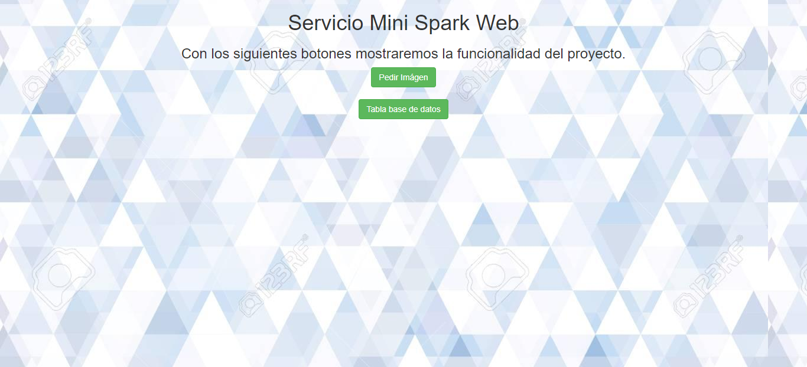

# Taller Cliente y Servidor

EL objetivo de este taller es crear una version mini del framework de Spark web para que responda a multiples solicitudes, como lo pueden ser imagenes de extensiones "JPG", "PNG", archivos de JavaScrip y conexiones a bases de datos.

# Funcionalidades

El framework es una version minima de spark que recibe multiples peticiones.

# Diseño

## Prerequisitos del sistemas
* Maven
* Git
* Java
* Heroku

## Descarga,instalacion y ejecución
Primero debemos clonar el repositorio, como veremos en el siguiente comando:

**git clone https://github.com/johanrueda/ClienteServidorArep**

Ahora ejecutamos una consola de comandos en el directorio donde fue clonado el repositorio y compilar el proyecto con el siguiente comando:

**mvn package**

Luego ejecutamos el programa con el siguiente comando:

**java -cp target/nanoSpark-1.0-SNAPSHOT.jar edu.escuelaing.arem.ASE.app.nanoSpark.nanoSpark**

de esta manera la aplicacion corre localmente, en tu navegador favorito colocas localhost:36000

Pero tambien dicha aplicacion tiene un despliegue en heroku que puedes utilizar en cualquier momento.

[Heroku](https://murmuring-anchorage-59220.herokuapp.com/index.html)

## Pruebas 

## Documentación

Para generar la documentación de Java Doc ejecute el siguiente comando:

**mvn javadoc:javadoc**

## Desarrollo

Este proyecto se desarrollo con:
* Maven
* Java 8
* Intellij IDEA
* Heroku

## Autor

**Johan David Rueda Rodriguez**

## Licencia
Este proyecto lo contiene la licencia GNU GENERAL PUBLIC LICENSE.